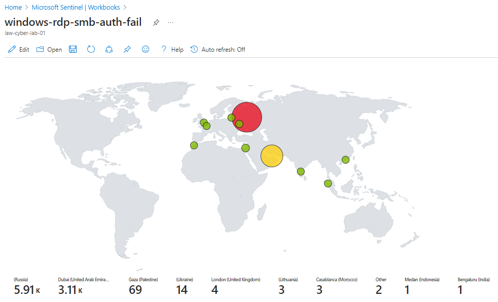

# Cybersecurity Project
<h1>Welcome to My Cybersecurity Projects Page! </h1>
<h4>My name is Michael Chronicle.  I'm having a great time learning about Cybersecurity along with some of the software used in the space. Please reach out if you have any questions. </h4>
<h4><a href="https://github.com/mchronicle/cybersecurity">Cyber Security Project</a>  <a href="https://www.linkedin.com/in/michael-chronicle/">Cyber Security Professional - LinkedIn</a></h4>

<h2>Security Operations Center (SOC) and Honeynet Using Microsoft Azure and Sentinel:</h2>

In this project, I created a honeynet using Microsoft Azure. I have included the steps below: 
- Created an Azure account 
- Created one subscription 
- Created one Resource Group 
- Deployed two Virtual Machines in the same region 
<li>Windows VM</li>
<li>Linux VM</li> 
- Deployed one VM in a different region and a different Virtual Network 
<li>Windows VM (used as an attack VM against the previously mentioned VMs for testing)</li>

All with the Security type being Standard in order to ensure vulnerability
 
- Configured the Firewall in Network Security Group (NSG) to let all traffic in 
- All ports were left open 
- Logged into the Windows VM via Remote Desktop Protocol (RDP) and changed the Firewall state to Off 
- Installed SQL Server 2022 on the Windows VM 
- Installed SQL Server Management Studio 
- Enabled logging for SQL Server to Windows Event Viewer (for successful and failed logins) 
- Installed Azure Active Directory 
- Created users and assigned permissions to access different resources 
- Created an Azure Blob Storage account 
- Created Log Analytics Workspace 
- Configured the AuditLogs & SignInLogs in Azure Active Directory.
- Created Sentinel 
- Ingested CSV files that consisted of IP Address blocks along with locations (country, latitude and longitude) into Sentinel from Azure Storage for my attack map 

Ran multiple queries using KQL (Kusto Query Language) after the logs were configured in Log Analytics Workspace

<h2>Tested failed logins using:</h2>
<li>Microsoft Sequel Server to log into the database</li>
<li>PowerShell to ssh into the Linux VM</li>

<h2>Before Hardening:</h2>

<h2>KQL script for Windows RDP Auth Fail with Attack Map (24HR Period):</h2>

SecurityEvent 
| where EventID == 4625 
| count

SecurityEvent 
| where EventID == 4625 and Account == '\\ADMINISTRATOR' 
| where TimeGenerated > ago(10m) 
| count

<h2>KQL script for Network Security Group Inbound Malicious Flows Allowed with Attack Map (24HR Period):</h2>

AzureNetworkAnalytics_CL 
| where FlowType_s == "MaliciousFlow" and AllowedInFlows_d > 0 
| where TimeGenerated >= ago(24h) 
| count

AzureNetworkAnalytics_CL 
| where FlowType_s == "MaliciousFlow" 

<h2>KQL script for MSSQL Server with Attack Map (24HR Period):</h2>

Event 
| where EventLog == "Application" and Source == "MSSQLSERVER" and RenderedDescription startswith "Login failed"

<h2>KQL script for Syslog SSH Auth Fail with Attack Map (24HR Period):</h2>

Syslog 
| where SyslogMessage contains "Mike" 
| order by TimeGenerated desc 

<h2>After Hardening</h2>

<h2>Spreadsheet Comparison Showing Before and After:</h2>
<h2>Before Hardening</h2>

<h2>After Hardening</h2>

<h2>Changes in Percentage Once Hardened:</h2>

<h2>Connect with me:</h2>

<a href="https://www.linkedin.com/in/michael-chronicle/">LinkedIn Profile</a> 

Resume:

